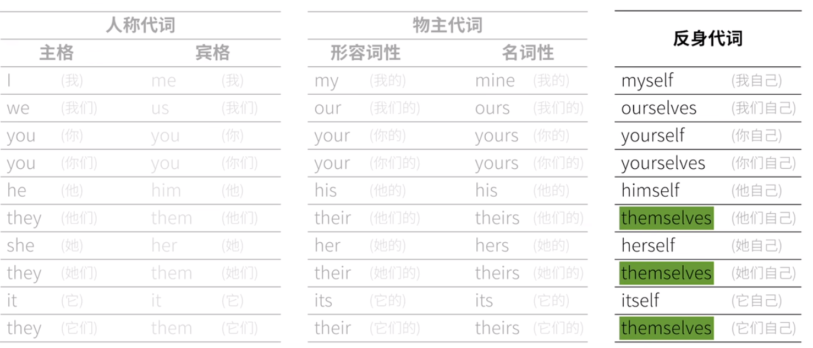
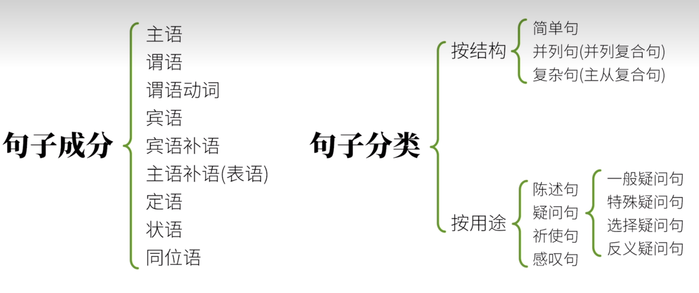

# **英语语法**

参考：   
https://hzpt-inet-club.github.io/english-note/  
https://www.bilibili.com/video/BV1XY411J7aG?p=1

# 一、词性

> 实词：能单独作为句子成分  
> 虚词：不能单独作为句子成分

- 名词(noun) :表示具体或者抽象的事物/人物
- 动词: 表示动作或者状态
- 形容词: 修饰名词
- 副词: 交代时间、地点、原因、程度等非核心信息。
- 冠词: a/an/the
- 介词: 出现在名词前，表示名词与其他词的关系
- 连词: 连接两个词语或者句子
- 代词(pronoun): 代指某个名词
- 数词: 跟数字有关
- 感叹词: 表说话感情

## 动词

### 谓语动词
三大本领：
- 动作时间
现在/过去/将来/过去将来(过去开始并将持续一段时间)
- 动作状态
一般/完成/进行/完成进行(已经开始且将继续下去)
- 动作假设、情感，即语气

#### 时态: 
1.  一般现在时：+ 动词原形  
- 表达事实、
I like you.  
- 表达习惯
The bus leaves at 8PM every day.  
- 表示预计发生的事  
The bus leaves at 8PM tonight.  
2. 现在进行时: + be(am/is/are) + 现在分词  
I am eating carrots.
3. 现在完成时: + have/has + 过去分词  
I have eaten carrots.
4. 现在完成进行时： hava/has + been + 现在分词  
I have been eating carrots.

5. 一般过去时: + 过去式  
The rabbit ate a carrot.
6. 过去进行时: was/were + 现在分词  
The rabbit was eating a carrot.
7. 过去完成时: had + 过去分词  
The rabbit had eaten a carrot.
8. 过去完成进行时: had + been + 现在分词  
The rabbit had been eating a carrot.

9. 一般将来时: will + 动词原形 
- 描述将来某个时间点发生的动作（说话者十分确定会发生的事）  
The rabbit will eat a carrot.
10. 将来进行时: will + be + 现在分词
- 描述将来某个时间某个动作是在进行的过程  
I will be eating a carrot for lunch tomorrow.
11. 将来完成时: will + have + 过去分词  
If suddenly you forget me  
Do not look for me  
For I shall afready have forgotten you
12. 将来完成进行时: will + hava + been + 现在分词  
You will have been watching my video.

13. 一般过去将来时: would + 动词原形 
I said i would eat a carrot for lunch.
14. 过去将来进行时: would + be + 现在分词  
I said i would be eating a carrot at 1PM tomorrow.
15. 过去将来完成时: would + have + 过去分词  
I said i would have eaten a carrot at 1PM tomorrow.
16. 过去将来完成进行时: would + hava + been + 现在分词  
I said i would have been eating lunch for 2 hours by 1PM.

#### 语气

##### 陈述语气

The rabbit ate the carrot.

##### 祈使语气
1. 用第二人称(“你”) 用一般现在时态
2. 去掉 “你”，保证动词原形

You eat the carrot1 => Eat the carrot!

##### 虚拟语气
1. 第一大用法：虚拟语气表“不可能”假设
- 与现在相反:  
条件句：if + 过去式  
主句： would + 动词原型  
If i were a rabbit, i would eat the carrot. -- 实际没吃

- 与将来相反  
条件句：if + should + 动词原形  
主句： would + 动词原形  
If i should meet thee(=you) after long years, how should i greet thee. - 万一我们将来重逢了，我又该如何面对你呢？ 言下之意：咋俩相会遥遥无期了。

- 与过去相反  
条件句：if + had + 过去分词  
主句：would hava + 过去分词  
If I had watched this vedio before, I would have aced my test.

2. 第二大用法：虚拟语气表达愿望、请求、建议、命令等  
wish/would rather/demand/suggest/insist/order...  
I wish that I were a rabbit.

#### 动词原形、现在分词、过去式、过去分词
现在分词：表主动和进行  
过去式：发生在过去、已经经过的事情  
过去分词：用于被动句或者完成时  

1. 规则动词变化

https://m.jenglishj.com/h-nd-148.html

| 构成规则 | 动词原形 | 过去式 | 过去分词 | 现在分词 |
| --- | ---:| :---:| :---:| :---:|
| -ed/-ing | work | worked | worked | working |
| 结尾是 e 的去掉 e 后加 -ed/-ing | live | lived | lived | living |
| 词尾是重读闭音节, 双写辅音字母后加 -ed/-ing | stop | stopped | stopped | stopping |
| 结尾是辅音字母+y, y变成i后 -ed，现在分词直接加-ing | study | studied | studied | studying |

### 非谓语动词

不受主语语态、时态影响

#### 动词不定式(infinit): to + do
- 做形式主语  
To eat a carrot every day is good for the rabbit.  
It is good for the rabbit to eat a carrot every day.  
- 做形式宾语  
I consider it important to eat a carrot every day.  
The rabbit expected the wolf to eat a carrot.  
 使役动词做不定式省略 to  
- 谓语动词后接不定式作宾补时，to 可省可不省  
The wolf helped the rabbit grow carrots  
The wolf helped the rabbit to grow carrots
- 做表语  
The rabbit's dream is to eat every kind of carrot in the world.
- 做定语  
The rabbit has a lot of carrots to eat.
- 做状语  
I was surprised to get a thumbs-up. - 原因状语  
I will do anything to get a thumbs-up. - 目的状语

#### 动名词: doing
- 做主语  
Eating carrots is healthy for the rabbit.
- 做表语  
Seeing is believing. - 眼见为实
- 做定语  
a sleeping pill - 助眠的药片
- 做宾语  
The rabbit likes eating carrots.

#### 现在分词：doing
相当于形容词
- 做定语  
a sleeping rabbit
- 做宾语  
The story is interesting.
- 做宾补  
The wolf saw the rabbit eating a carrot.
- 做状语  
 Hearing the news, the rabbit became excited.

#### 过去分词: done
- 做定语, 过去分词短语做定语要放到被修饰的名词后面  
The rabbit will eat minced carrot next week.  
The carrot cake eaten by the rabbit is delicious.
- 做表语  
现在分词做表语暗含主动关系，即被描述的做出动作的人/物，过去分词暗含被动关系，被描述的是动作的接收者   
The rabbit is interested in growing carrots.  
I am interested. - 我被某人/某物引起了兴趣  
I am interesting. - 我引起了某人的兴趣
- 做宾补  
The rabbit found his carrot stolen.
- 做状语  
Seen from the hill,the carrot field looks beautiful.

#### 独立主格  
一个简单句除去核心的谓语动词外，其他的动词转为对应的过去分词或现在分词的用法，称为“独立主格”  
独立主格：句子中现在分词和过去分词是在句中的状语里（并非句子的主语），但是在状语本身里，分词修饰的对象（句中的work和weather），隐含了一层“主语”的意味，虽然并不是整句的主语

- 名词 + 动词不定式  
The rabbit to come, the wolf is overjoyed.
- 不定代词 + 名词  
Many animals went to the party, some of them ~~being~~ rabbits and wolves.
- 不定代词 + 形容词  
Many animals went to the party, some of them ~~being~~ happy.
- 名词 + 副词  
The rabbit sat on a chair, head ~~being~~ down.
- 名词 + 介词短语  
The rabbit came in, carrot ~~being~~ in hand.

#### 助动词 & 情态动词
定义：
- 助动词辅助助动词
- 助动词不能单独做谓语动词

分类：
1. 基本助动词
- be
- do  
The rabbit does like coins! -- does 指强调
- have
2. 情态助动词
- can/could  
> 表能力，许可，疑问句中表诚恳语气，could 语气比can强烈  
> 陈述句中表推测，could 比 can 的可能性更低  
Can / could (语气比can更委婉) I borrow your book?
- may/might  
> 也许、大概、可能。  
May/might I borrow your book?  
> 表祝福  
May you successed!  
> 可能性: can > could > may > might  
> 委婉语气: might > may > could > can  

- will/would  
> 构成将来时  
> 表示请求，建议  
Will you lend me that book?  
Would you please lend me that book?  
> 表推测、假设  
Ask him.He will/would know.

- shall/should
> 构成将来时
> shall 征求意见
Shall we meet at 9AM?
> shall 表警告、命令  
You shall not pass!   
> should 表应当  
We shoud treat the rabbit well.  
> should 表推测，根据具体情况做出的推测，可能性较大  
It should rain tomorrow.  
> 竟然  
It's surprising that he should be late.  
> 虚拟语气  

- must  
> 必须  
 The light is on.The rabbit must be at home. -- 灯亮着，兔子一定在家  
> must not/ must't 必须不  

- ought to
> 表应该，同should，语气更强  
We ought to treat the rabbit well.

- dare/dared
> 敢，用于否定句和疑问句  
How dare you!  
The rabbit dare not tell the truth to the wolf.

- need  
> 需要，有必要  
The rabbit need(情态动词) wait. = The rabbit needs(实义动词) to wait.  
The rabbit need not wait. = The rabbit does not need to wait.  

- used to  
> 表习惯  
The rabbit used to eat apples.Now he noly eats carrots.  

3. 半助动词
- be able to
> 表将来的能力,  
I'll be able to reach school on time if I leave right now.  
I was able to reach school on time because I left home early.
- be going to
> 计划做某事  
I Will graduate in 3 years.  
I am going to graduate in 3 years.

- be about to
> 马上做某事

- be to
> 表命令、命中注定  
You are to finish home work first.  
I think they're to fall in love with each other. -- 我想他们注定会相爱

- had better
> 最好做
You had better follow my orders.

- have to
> 表命令
You have to work.

#### 系动词  
将前后部分连系起来。
be(am/is/are/was/were), keep, stay, seem, appear, feel, become, turn, prove...  
I am tall.
The carrot smells nice.

#### 使役动词  
含义：使、令、让  
语法：使役动词 + 宾语 + 宾语补语

1. make 迫使做
- make + 动词原形/裸不定式
I make the wolf (to) eat carrots from time to time(时不时).
- make + 形容词
The carrot made the wolf full.

2. let 允许做
- make + 动词原形/裸不定式
I'll let the wolf eat some chocolate.
- make + 副词
Let me out.

3. have 给任务做  
- make + 动词原形/裸不定式  
I'll hava the wolf wash the dishes.  
I had someone wash my car -> I had my car washed.  

4. get 说服做
I'll get the wolf to clean the kitchen after she washes the dishes.  

## 形容词

形容词与名词的关系： 前置定语和后置定语  
### 前置定语
名词短语 中，用形容词修饰一个 名词 ，通常结构为 「限定词+形容词+名词」  
当多个 形容词 修饰一个 名词 时， 大家记住一个大原则： 「观点形容词 + 描绘形容词」  
观点形容词：表示对事物的看法  
描绘形容词：表示事物本身的特征  

### 后置定语

- 在修饰「some，any，no，every」 和「one，thing，body」的 合成词 时， 形容词 要后置。
- a- 开头的那些单词
- 修辞词太复杂了，后置：当修辞词本身带有不定式， 介词词组等补足成分时，也要被后置

### 用法
1. 定语   
a hungry rabbit  
carrots good for the rabbit  
2. 表语  
The rabbit is hungry.  
3. 补语  
Carrots make rabbit happy.  
4. 状语  
The rabbit came home, tired and huntry.

## 副词

在英语中，这 副词 按 构词法大约分为两类：
- 一类是形容词+ly的派生词， 如，recently，politely，carefully等
- 另一类是不+ly的，有些词跟它的形容词还长得一模一样 如，late，fast，hard

1. 用法：
- 副词 + 形容词  
This is a very fast rabbit.  
- 副词 + 副词： 修饰的词在前，除 enough 必需后置  
This rabbit runs very fast.
- 副词 + 动词： 通常副词在后，放前的两个场景：如果放后面有歧义则放前面，以及表达强烈语气(如 only/ merely/also/especially/even/particularly/utterly/almost/surely 等)  
This rabbit runs fast.  
He kissed the girl tenderly living next door. - 此处 tenderly 如果是要修饰 kiss 就应该提前  
I almost fall in love with you.  
- 副词 + 名词  
This rabbit here runs very fast.  
- 副词 + 句子  
Obviously, this rabbit here runs very fast.

2. 在句中作什么成分
- 状语
- 定语
- 表语(只能位于变为的 be 动词之后)
The wolf is **abroad**.
- 宾语补语  
Let me **in**!

## 冠词  
固定表达  
hava a good time 玩的开心     
as a result 因此，结果  
in a hurry 匆忙地  
all of a sudden 突然  
演奏西洋乐器 play the piano  
all the time 一直，总是      
by the way 顺便  
out of the question 不可能，没门  
from time to time 不时地  
face to face 面对面地  
out of question 毫无疑问      

## 介词

- in 强调包含
- on 在表面
- at 强调把事物看成一个点

1. 表空间  
- in 空间内部  
birds in the tree  
- on 在物体表面，有接触，引申为一体的  
apples on the tree  
- at 表确切的点  
- over 覆盖，在。。。上方， 越过上空  
The mother put a blanket over the child.  
the bridge over the rivrer  
The plane flew over the mountain.  
- above 在。。。上（高于平面）  
the sky above us  
- under 在。。。下（与 over 相对）
- below 在。。。下（与 above相对）
- near 附近，有距离
- by 在。。。旁边，更接近
- beside  在。。旁边， 更接近
- next to 紧挨，下一个，在。。。旁边
- across 从表面穿过
- through 从内部穿过
- past 经过、路过
- in front of 在。。。前方
- before 在。。。前，不常用于空间，除非是在观众前
- behind 在。。。后
- between 在。。。之间，可用于多者之间
- among 在。。。之间，多用于多者之间
- round/around 围绕，环绕   
around the world 全世界   
- along 沿着、顺着  
- to 向，朝  
go to school  
- toward/towards 朝着。。。的方向
- onto 到。。。上
- into 到。。。内部
- out of 从里向外
- oppsite 在。。。对面
- against 于。。。相反，倚，靠
- up 沿。。。向上
- down 沿。。。向下
- off 离。。。有些距离  
2. 表时间
- in 时间范围
- on 时间范围，具体某天
- at 时间点
- during 持续  
during the past 2 days 过去的两天里  
- for 因为。。。，因。。。持续  
I have been learning English for 2 years.  
- before 在。。。之前
- after 在。。。之后
- from ... to ... 从。。。到。。。
- by 不迟于。。。之前
- utill 直到。。。为止
3. 表方式
- in 。。。方式，在。。。里面  
in English  
- through 通过。。。方式
- by 通过。。。  
learn English by watching vedio.
- with 用。。。，和。。。一起
- on 在。。。上面，用于通讯设备多  
4. 表原因
- for 因为，由于
- with 是和。。。分不开的原因  
The rabbit is shaking with cold.  
- because of/duo to/owing to/on account to + n 因为  
The rabbit didn't go out due to/owing to/on account to the rain.
5. 表关于
- about 关于  
think about 想起关于。。的事
- of 相关的  
think of 想起
- on 关于  
Would you like some advice on learning English?  
6. 表数值
- at 在某处  
at a hign price  
at a fast rate 
- by 后接度量标准  
They get paid by the hour.
- for 以。。。的价钱  
I bought these books for 100$.  
7. 表状态
- in 在。。。里，在。。。状态中  
in progress 
- on 受到之下。。。的支持  
on a diet 在节食  
- at 在某个状态  
at work
- under 在（框架，前提）下  
under discussion 讨论中  
8. 表排除
- besides 除。。。还
I like  many things besides carrots.
- except  除了。。。
Every one went to the party except the rabbit.
- except for 除了。。。 用于对之前的内容否定  
The party is great except for the loud music.

## 名词

## 代词

### 相互代词 
- echo other 两者之间
- one another 多者之间

### 指示代词
- this
- that
- these
- those

### 不定代词
- many 修饰可数名词
- much 修饰不可数名词
- a few/few + 可数名词复数，表肯定
- a little/little + 不可数名词， 表否定 
- some 表肯定
- any 表否定和疑问句
- each + 名词单数， 可以单独做主语， 两个以上
- every + 名词单数， 要和名词一起使用， 三个以上
- either 两者中的一个（谓语用单数）
- neither 两者都不（谓语用单数）
- both 两者都
- all 三者以上都
- other
- the other 特指两者中的另一个
- another 泛指三个及以上的另一个
- 复合不定代词 every-/some-/any-/no-

### 疑问代词
- who/whom   
- why
- what
- which
- whose
- where
- when

### 连接代词
who/whom/whose/what/which/whoever/whomever

## 数词
1. 基数词 
- 1-10 one, two, three, four, five, six, seven, eight, nine, ten  
- 11-19 eleven, twelve, thirteen, fourteen, fifteen, sixteen, seventeen, eighteen, nineteen  
- 20-90 twenty, thirty, forty, fifty, sixty, seventy, eighty, ninety  
- 百 one hundred, two hundred...  
- 千 one thousand, two thousand...  
- 千分位 million billion  
> 21 twenty-one  
365 three hundred and sixty-five  
3546 three thousand five hundred and forty-six  
10000 ten thousand  
478,873,467,823 four hundred and seventy-eight billion eight hundred and seventy-three million four hundred and sixty-seven thousand eight hundred and tweety-three  
hundreds of  数以百计    
thousands of  数以千计  
millions of 百万计  
2. 序数词  
带顺序的数字，如第1，通常是**基础词+th**    
- 1-12 first second third fifth eighth ninth twelfth  
- 20-90 y变ie+th， twentieth  
- 缩写通常是 **阿拉伯数字+th1st**, 7th, 除了 1st, 2nd, 3rd  
> 第22 twenty-second

3. 数词的用法
- 分数 **基数词/序数词**，若分子大于1是 **基数词/复数序数词**  
- 整数+分数  **基数词 and 分数**  
- 小数 **基数词 point 1-10按顺序**  
- 百分数 **基数词 percent**  
- 倍数 **half/twice/three times + 固定搭配**  
- 运算符 **plus=+; minus=-; multiplied by=*; divided by=/; squared=平方; cubed=立方; be more than=>; be less than=<**  
- 时间
- 日期： 英式 日/月/年； 美式 月/日/年
- 长 long(adj)/length(n) 
- 宽 wide(adj)/width(n)
- 高 high(adj)/height(n)
> 1/3 one third  
3/5 three fifths  
1/2 a half;one secend  
1/4 a quarter;one fourth  
3/4 three quarters  
1.34 one point three four  
25% twenty-five percent  
This carrot is **half/twice/three times the size of** that one. - 这跟胡萝卜是那一根的一半/两倍/三倍大小  
I have **half/twice/three times as** many carrots **as** he has.  
I can eat **three times faster than** he can.  
I have increased my income **by three times**.  
7:00 at seven; 7:15 seven fifteen; 7:30 half past seven; 7:50 ten to eight  
2022-11-12 12th December 2022(英); December 12th 2022(美)  
公元前500年  500 B.B.  
公元500年 500 A.D.  
21世纪20年代 2020's/2020s
The river is 1000 meters **long(=in length)**.  
This room is 20 by 35 meters. - 长20m， 宽35m
This room is 700 square meters. - 700平方木  
This box is 8 by 5 by 6 centimeters. - 长8cm，宽5cm，高6cm  
37 ° 37 degrees centigrade  
37 °F 37 degrees Fahrenheit  
-10 ° 10 degrees below zere  

## 连词
- and 且、和
- Both... and... 两者都
- not only...but also... 不止。。。还有。。。
- neither...nor... 两者都不
- or 或
- or else 或者
- otherwise 或  
Hurry up, or/or else/otherwise you'll be late.
- either...or...  
Either the rabbit or I am going to the party this evening.
- but/yet 但是
- so/therefore 所以
- for/because/since 因为
- that

## 叹词
打招呼 hello, hi, hey, hiya  
惊讶 oh,ooh,oh my god! Jesus! gee,om my! huh?!wow,gosh,oh dear,dear me,oh my goodness,oh boy  
犹豫 hmm,er,uh,erm,well,oh well  
高兴 ah!yeah!yay!hooray!aha!alas!Thank god!  
感动 aww  
疼痛 ow,ouch   
鼓励 yes,congratulations! congrats! bravo!come on(c'mon),attaboy  
赞同 yes,yep,ok,okay,indeed,cool,bingo,great,excellent,brilliant,fantastic  
反对 no,nope,no way,nah  
确认 please?yeah?eh?right?  
后悔 opps  
伤心 no,oh no  
厌恶 eww, ugh  
使注意 psst  
使安静 Sssh  
不耐烦 oh man,duh,darn,damn,blah blah blah,yadda yadda yadda  
愤怒 jesus,for god's sake,jesus christ,shit,fuck,what the fuck,what the hell  

# 二、句子成分

- 主语(subject): 在一个句子中充当主角，是全句述说的对象
- 谓语(predicate): 是主语做的动作，帮助说明主语
- 宾语(object): 动作作用的对象，也是句子中的配角
- 定语(attribute): 修饰限定名词，位于主宾前
- 状语(adverbial): 作修饰，说明地点，时间，原因，结果，条件，方式，方向，程度等，位于谓语前
- 补语(): 对句子进行补充，使其意义完整。补语分为主语补足语和宾语补足语。位于谓语后
- 同位语: 同位语等同于前面的名词，可以与之互换
- 表语: 也称为主语的补语，表示主语的状态

## 简单句
**五个重要句型：**
1. 主语 + 不及物动词  
I sleep.
2. 主语 + 单及物动词 + 谓语  
I teach english.
3. 主语 + 双及物动词 + 间接宾语 + 直接宾语  
I teach you english.
4. 主语 + 复杂及物动词 + 宾语 + 宾补  
I think you smart.
5. 主语 + 系动词 + 表语  
He is tall.

## 复合句：不分主次  
The rabbit was hungry,and he ate some carrots.

## 复杂句：主句 + 从句  
### 从句  
#### 名词性从句
1. 主语从句  
That the rabbit ate a carrot is obvious.  
It is a secret that the rabbit ate a carrot.  
It is obvious whether the rabbit ate the carrot.  

2. 宾语从句  
I saw that the rabbit ate a carrot.  
I saw whether the rabbtit ate the cattor.  
**宾语从句的引导词可以省略**  
I know (that) the rabbit ate a carrot.  
**否定词加在谓语动词前，而非从句中**  
I don't think (that) the rabbit is smart.  
**主从时态一致（不变的客观事实用一般现在时）**  
I did't think (that) you were right.  
I knew (that) the sun rise in the east.

3. 表语从句  
The problem is that the rabbit is hungry.  
It seems that the rabbit is hungry.

4. 宾语补语从句  
You can call me what you like.

5. 同位语从句  
The fact that the rabbit ate the carrot did not surprise me.  
The question whether the rabbit will eat the carrot is on all our minds.  
I have no idea who ate the carrot.  

#### 形容词从句=定语从句
结构： 先行词 + 关系词 + 从句
##### 关系词
1. 关系代词  
The rabbit is eating a carrot that i bought.  
The teacher who ate a carrot is a rabbit.  
The teacher whom I saw yesterday is a rabbit.  
The teacher whose favorite food is carrot is a rabbit.  
The food which the teacher likes is a carrot.  

that vs which: 先行词唯一选 that，非唯一选 which 或 that

2. 关系副词 = 介词 + 关系代词which  
This was the place where(=at which) the rabbit ate the carrot.  
This is the reason why(=for which) the rabbit ate the carrot.  
That was the day when(=on which) the rabbit ate the carrot for the first time.  

The rabbit ate the carrot which was on the table. - 此处which 限定了 the carrot
The rabbit ate the carrot, which(=The rabbit) was on the table.

#### 副词从句=状语从句
1. 表时间（如：在。。。前）  
**before** 在...之前    
**when** 时间点，“突然”  
The rabbit was about to eat a carrot at home when the wolf stopped by.  
**while**  时间段  
**as**  强调两个动作同时进行  
**after**   在。。。之后  
**since**  从某时间点开始算  
The rabbit has shared three carrots since the wolf stopped by.  
**until**  直到之后某一时间点  
The rabbit waited until the wolf stopped by.  
**as soon as**  一。。。就    
**the next time** 下次  
The rabbit will share the biggest carrot the next time the wolf stops by.  
2. 表地点（如：在。。。地方）  
**where** + "强调形式"(whereever,everywhere,anywhere)  
The rabbit sees a carrot everywhere(=every place where) he goes.  
The rabbit ate the carrot where he found it.  
3. 表条件（如：如果。。。）  
if, unless, provided, as long as, in case  
**条件句的时态比主句落后一个时间段**  
If the rabbit sees a carrot, he will eat it.  
Unless you like this vedio, you will not give it a thumbs-up.  
Provide that my vedio is excelletn, you will give it a thumbs-up.  
4. 表让步（如：虽然。。。但是）  
**假设 even**
Even if I see a carrot, I will not eat it.   
**事实 Although/Even though/though**  
Although I see the carrot, I will not eat it.  
**no matter+疑问句**  
No matter what happens, I will not eat the carrot.  
5. 表方式（如：就好像。。。）  
I fell good as if I just ate a carrot.  
Eat the carrot the way (in which) I eat it.  
6. 表比较（如：比。。。）  
**更**  比较级  
He is smarter than me. - 口语化省略用法  
He is smarter than I am. - 书面正式用法  
**同样得** as  
He is smarter as I am.  
**越。。。越。。。**  
The more you practice English,the more fluent you become.  
7. 表原因（如：因为。。。所以）  
**because 因为**  
**since 既然**  
Since you are hungry, you can eat the carrot.  
**as 因为**  
As you were not here, we ate the carrot without you.  
because > since > as  
语序： because 可以放前后，since 和 as 只能放前面。
8. 表目的（如：为了。。。）  
In order that I could finish the vedio in time, I pulled an all-nighter.  
9. 表结果（如：所以。。。）  
**so that**  
I ate a lot of carrots for lunch so that I wasn't hungry at all in the afternoon.  
I ate so many carrots for lunch that I felt sick afternoon.  
It was such a tasty carrot that I ate it all at once.  

## 倒装句
1. 完全倒装句
- 副词/介词短语在句首的倒装  
**地点副词在句首的倒装**  
There goes the last bus <- The last bus goes.  
**时间副词在句首的倒装**  
Now comes the wolf's turn! <- The wolf's tun comes now!  
**表运动方向的副词在句首的倒装**  
Up went the carrots into the air! <- The carrots went up into the air.  
**介词短语在句首的倒装**  
At the table sat a rabbit. <- A rabbit sat at the table.
- 主语补语(表语)的倒装  
Seated on the ground is a group of rabbits. <- A group of rabbits is seated on the ground.
2. 部分倒装句
分离助动词和谓语动词，提前助动词.  
**句首有否定意义词时的倒装**  
Never before have I eaten such a delicious carrot. <- I have never eaten such a delicious carrot before.  
**句首有noly时的倒装**  
Only in this way can we grow delicious carrots <- Only in this way We can grow delicious carrots   
**if...should...构成虚拟语气的倒装**  
Should I win the lottery, I would buy a huge pile of carrots. <- If I should win the lottery, I would buy a huge pile of carrots.  
**固定句型中的倒装**  
So do I.  
The rabbit can't ride a bicycle;neither/nor can the wolf.  
3. 形式倒装  
**感叹句中的倒装**  
What a delicious carrot it is! <- It is a delicious carrot.  
**比较级句型中的倒装**  
The more carrots you eat,the healthier you become.  
**however;whatever 引导让步状语从句时的倒装**  
However long this video is,you should watch it till the end.  
**as;though...引导的让步状语从句时的倒装**  
Much as he likes the carrot,he doesnt want to eat it.

## 强调句
## 省略句
## 主谓一致

# 英语构词法
1. 派生
- 词根: 核心含义
- 词缀: 表示意义、属性
> 前缀 prefix  
 in/im/un/il/ir/mis/dis/de/non 否定  
 en 使...  
 pre 在...前  
> 后缀 suffix  
ible 能被
2. 合成  
> waterfall  
waterproof  
underwater  
3. 混合
> brunch(早中餐)=breakfast + lunch  
smoke(烟) + fog(雾) = smog(烟雾)
4. 截短
> telephone -> phone
5. 缩写
> VIP=very important person
6. 转化(一词多义、一词多性)

