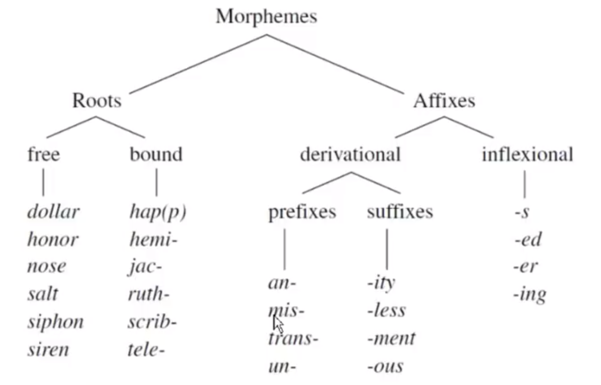
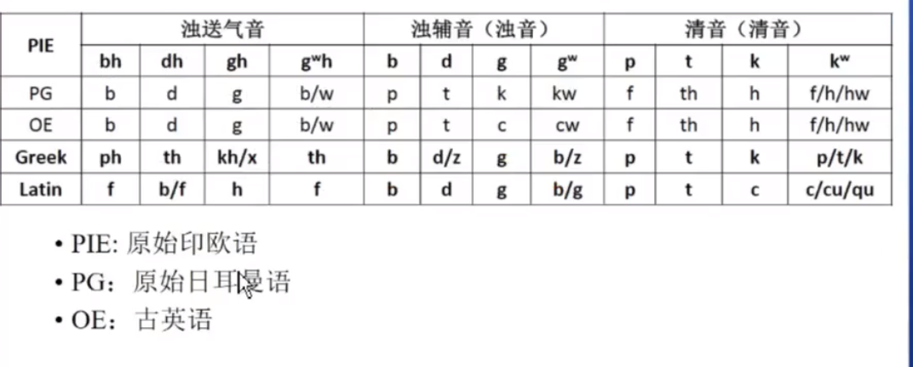
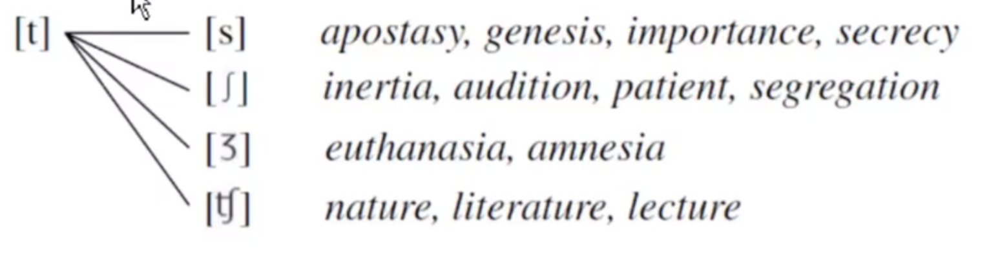
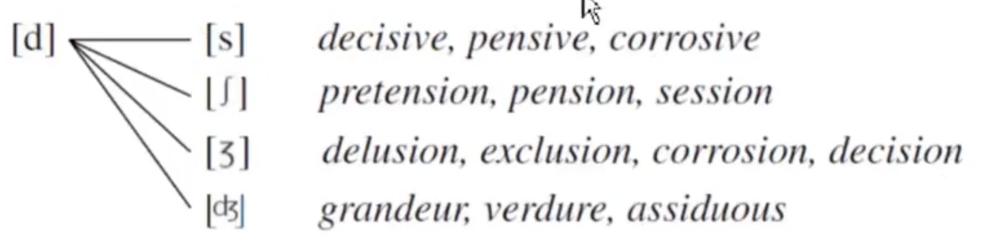
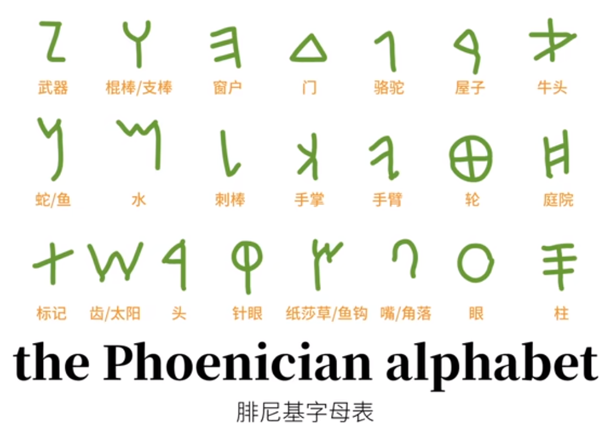

**音变：同一个单词改变不同的音而变成不同的单词**
1. a/e/i/o/u/w/y
2. b/p/f
3. d/t/th
4. g/k/h
5. m/n/l/r
6. u/v/w

**辅音构成含义，元音不影响单词本意，只负责发音**

音素：单词中具有含义的最小部分
分为词根(roots)、词缀(affixes)  
词缀分前缀(suffixes)、后缀(prefixes)，还可以分派生词缀(derivational affixes)和曲折词缀(inflectional affixes)。  
派生词缀：改变单词的词性  
曲折词缀：改变功能

自由词根： 可以单独成词  
黏着词根： 不能单词成词

### 音变分三类：
##  零变化  
## 有规律的变化  
### 用一个音替换一个音  
1. **唇音同化**  
- n + [p,b,m,f] => m, f, un 例外  
> en + ploy => employ   
syn + bol => symbol  
con + firm => confirm  
in + fant => infant  
- g + [t,s] => k  
> ag + t => act  
se + let + t => select  
- b + [t,s] => p   
> scrib + t => script  
- v + [t,θ] => f  
> give + t => gift  
- ad - to,towards,against  
> ad + rive => arrive
- ad + [st-,sp-,sk-] => a  
> ad + scribe => ascrible  
- ad + [m,v,j,h] => ad  
> ad + jective => adjective
2.  **辅音弱化**  
- t + [-y,-e,-is,-ia] ->  s  
> stat(stay) + is => stasis  
grat + e => grace  
dict + ion => diction  
in + port + ant + e => importance  
secret + y => secrecy

- d + [-ive,-ion,-ile] => s
> pend + ive => pensive

- v + C => u
> solv + tion => solution
3. 元音弱化
- a 前有任意字母时弱化成 e
> art => artistic => inert(without kill)  
cand(shining white) => candid => incendiary  
cap(seize) => captive => deceptive  
fac(make,put) => fact => infect(put in)  
例外 manufacture,recapture
- e 词素结尾结尾必须是一个单独的辅音字母&不在单词第一个音节&后跟着元音 时弱化成 i, 例外是不影响 [l,m,n,r] 结尾的词素
> leg(choose) => legion => diligent  
sed(sit) => sediment => president  
spec(look,see) => spectacle => conspicuous  
dem(people) => endemic  
her => inherent
- el | ol 后有辅音变成 ul
> cel(cover) => cellar => occult
### 删除一个音
- 重复 s 删除
> ex + spir => expire  
ex + cep + t => except  
ex + sample => example
dis + sperse => disperse  
- trans-
- ex- 后遇到一个辅音且是浊辅音，x脱落
> ex + lev(light) + ate => elevate
- ex- 遇到f 时发生同化
> effect  
effort
- 否定前缀 an- 后接辅音 n 脱落
> an + chromat(color) + ic => achromatic
- con- 后接元音 n 脱落
> con + ag + ulate => coagulate  
- syn- + s + 辅音 n 脱落
> syn + st + (e)m => system  
syn + stol + ic => systolic
- 间断：两个元音发两个音节
> coat oa 非间断  
naive ai 间断
- 双音节元音 + 元音或者 h 脱落第一个音节的元音， 例外： anti-, poly-, semi-, neo-, macro-, iso-
> an + theo(god) + ism => atheism  
例外 meta + hod(way) => method
### 插入一个新的音
- 爆破音 + L + 元音发生变化，[gl,bl,kl,pl] + 元音 => [gul,kul,bul,pul]
> single + ar => singular  
particle + ar => particular  
- 英语中最后的 -e 是为了说明 /l/ 是一个音节
> single
- 当前一个词素以 m 结尾遇到 t 变成 mpt
> assume => assumption  
tem => tempt
- -n + s => nts
## 无规律的变化  
### 词素变体
#### 变级 gradation
描述印欧语元音 e 和 o 的。它们之间可以发生变化，以及零变级。产生不同的语法形式，用来派生各种各样的单词
1. 词素变体含有 e 的，称为 e-grade
2. 含有元音 o d，称为 o-grade
3. 没有元音的，叫做 zero-grade
> kei(hollow,cover) => cellar => color => cladestine  
gen(birth,origin) => genetic => genorrhea => cognate  
mer(think,warn) => demented => admonish => mnemonic  
#### r 音化 rhotacism
- 如果一个词素是以 元音 + s 结尾，加上元音开头的后缀，那么 s 变成 r  
> flos(flower) + al => floral(of the relating to flowers)  
flos + cule => floscule  
ges(carry) + t + ure => gesture  
ges + und => gerund  
#### 换位
> meta(change,beyond) + the + is =? metathesis  
- ks => sk
> mix => promiscuous
- pek => kep
> spectacle => skeptic
- ri => er/ir
> triad => ternary => third
- rt => tr
> nurture => nutrition
###  格林定律和维尔纳定律
#### b - p - ph - f - v - w
- B-F
> bro(兄弟) => fro => fra + ter + n + ity => fraternity 兄弟情义，兄弟会
- B-F-PH
> bha-(说话) => fame 名声， m 表示最终状态  
eu + phem + ism => euphemism
- B-P
> reub(抓、抢) => rob
- F-V
> leubh(关心、爱、渴望) => love => be + liev + e => believe  
liev => be + lief => belief 信仰、信条
- P-F
> pater(父亲) => father  
ped(脚) => foot
- V-W
> in + vad + e => invade 侵略
#### dh - d - t - th - f
> dheub(深的) => deep  
dher(紧握、坚守) => der => fer => firm 坚固的、固定的
dheigh(捏、形成、建造) =》 deigh => dough => feigh  
dhwer(门) => dwer => door
#### gh - g - k - c - qu - h - th - f
> ghel(照耀，发光) => gel => gold
> ghel(照耀，发光) => gel + ss => glass  
gheu(喷) => geu => gey => geys + er = > geyser 间歇喷泉、热水器
#### C-D, c-s
- c-p
> kwel(旋转，围着一个地方转) => kel => cel => cul => culture 文化、栽培、耕作  
- c-s
> fac(做) => fas => fash + ion => fashion 时髦、塑造
#### d-g,d-r,d-t-l,d-z
- d-g
> wadh(发誓、承诺) => wed(许诺、订婚、结婚)  
reudh => redh => red => roud => rouge 胭脂，红色染料
- d-r
> med(中间) + um(中性) => medium 中间的
- d-l-t
> od(闻) => ol + fac + t + ory => olfactory 闻到气味、嗅觉的
- d-z
> od => oz +one => ozone 臭氧
#### g
- g-b-v
> gwere(重) => grav + ity => gravity 重要性、严肃性、重力、地心引力
> gweie(生存) => bweie => beie => bei => bio + log + y 生物学
- g-y-j
> ghel(发光、照耀) => yellow
> gab(说话) => gib + e => gibe 嘲笑、嘲讽
#### s
- s-h
> sem(一、同一) => homo + sex + u + al => homosecual 同性恋  
sem => same => some
- st-t
> sta(站) => stand
- s-z-r
> ghel => glass => glaze 安装玻璃  
grass => graze 放牧
#### other
- p-q-f
> penkwe(五) => five
- t-ce
> fort(坚固、力量) => force 力量、勇气
- w-g-gu
war(看护) => ward 守护 => guard 守卫、保卫
- y-i-j
- y-z
> yes(煮沸、发泡) => ec + zem + a => eczema 湿疹

