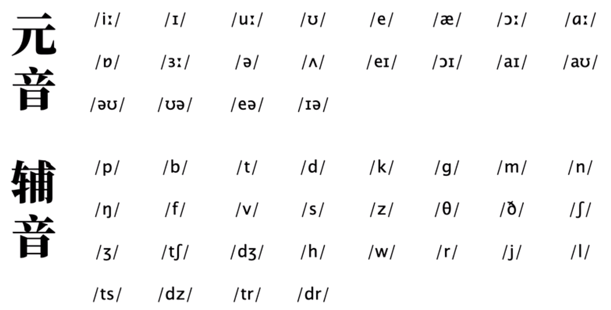
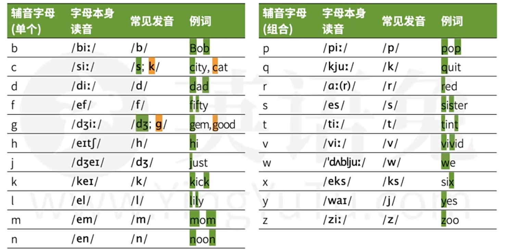
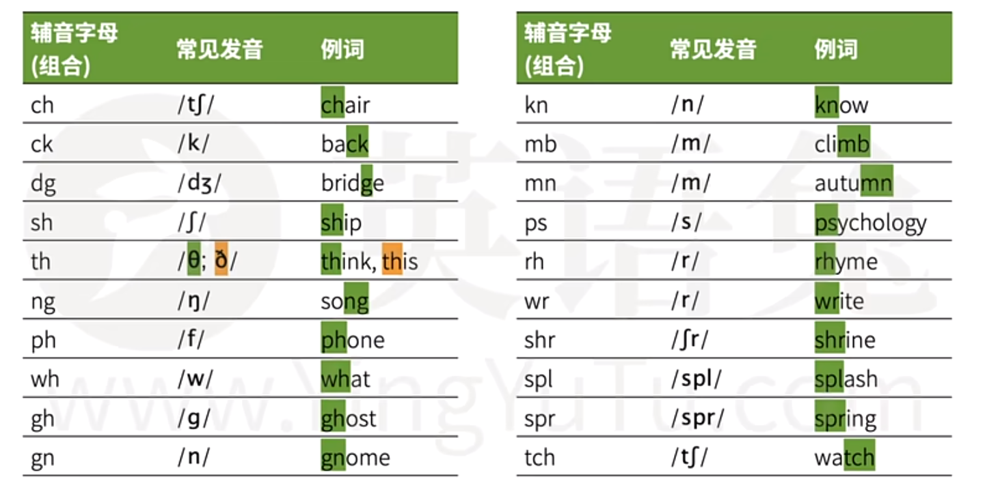
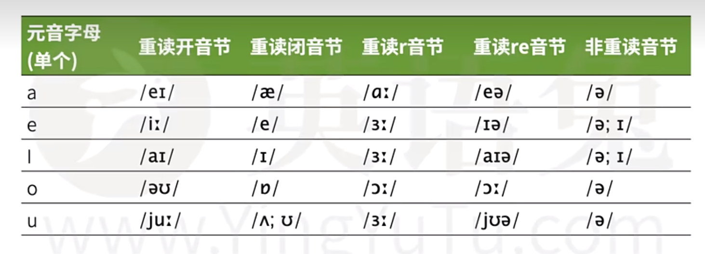
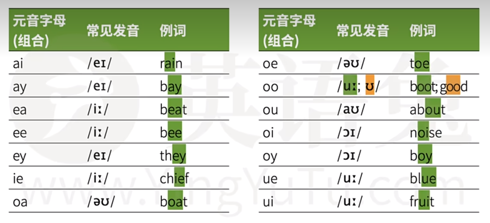

# 音标
链接：[全网最适合中国人的免费音标课(纯干货, 超详细!)](https://www.bilibili.com/video/BV1iV411z7Nj/?spm_id_from=333.999.0.0&vd_source=df4393fbbe7fe2f0bf9b098879d5483c)

[48个英语音标示范发音 (建议收藏)](https://www.bilibili.com/video/BV1vi4y1C73C/?spm_id_from=333.999.0.0&vd_source=df4393fbbe7fe2f0bf9b098879d5483c)

# 自然发音
链接：[英语自然拼读极简教程（免费、简洁、高效 | 半小时内打牢基础）](https://www.bilibili.com/video/BV14841117gz/?spm_id_from=333.999.0.0&vd_source=df4393fbbe7fe2f0bf9b098879d5483c)

